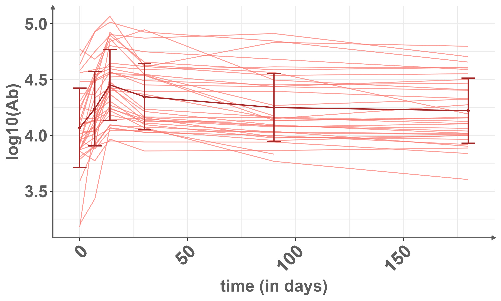
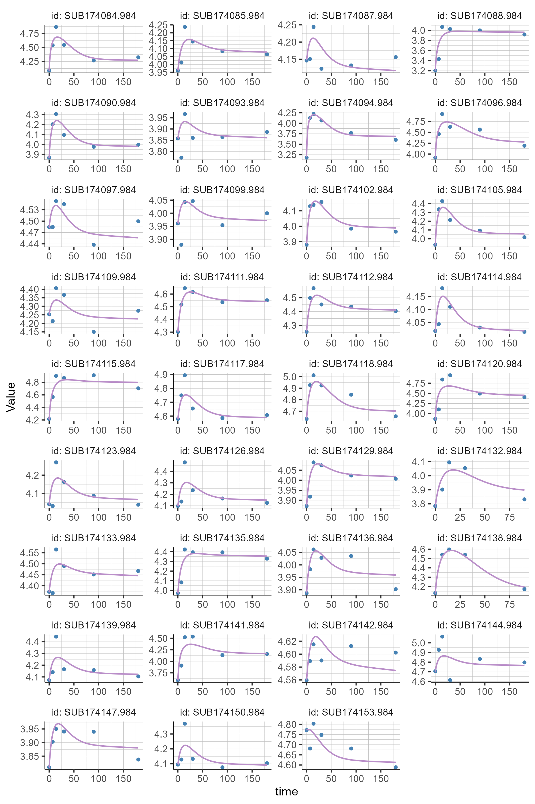
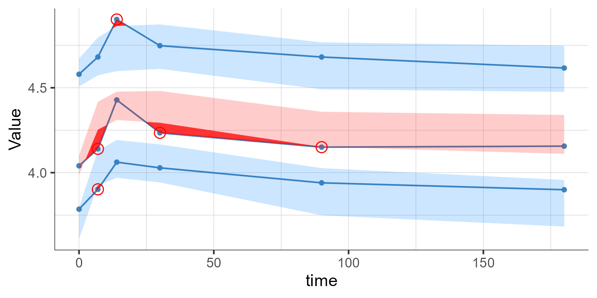
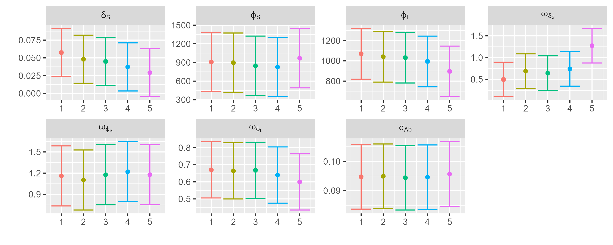
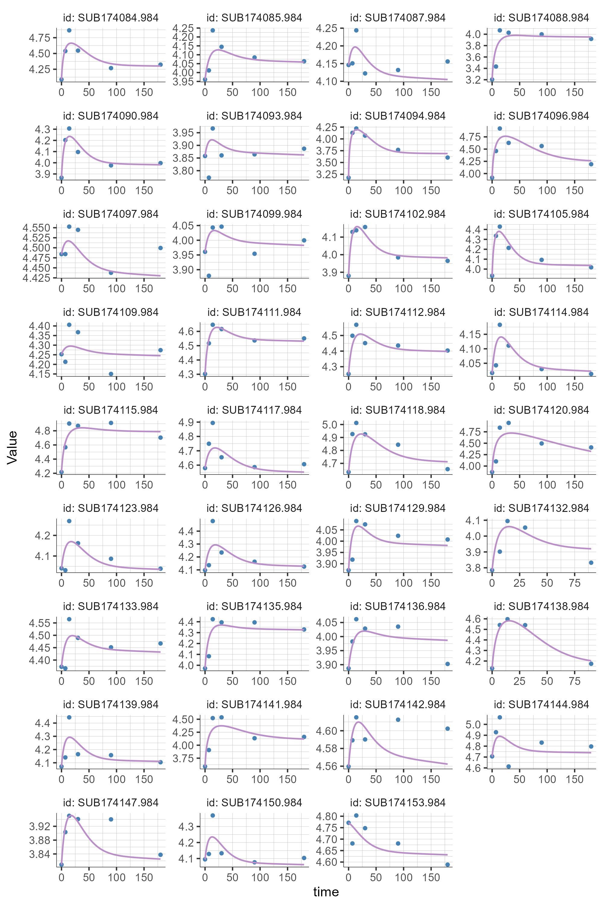
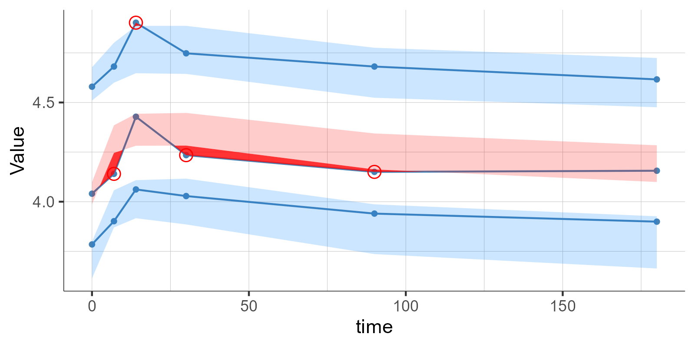
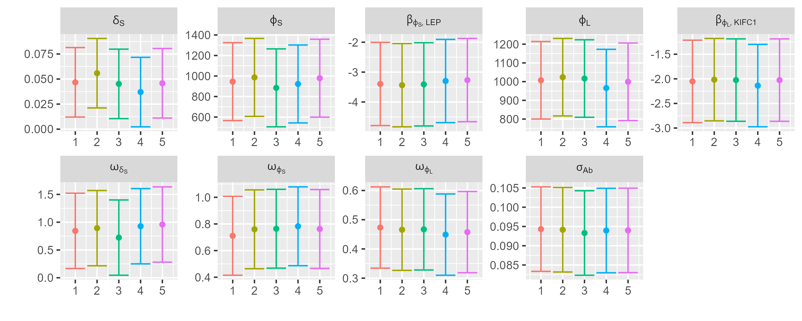

# Application to ZOSTAVAX data from the ImmuneSpace

``` r
library(ggplot2)
library(dplyr)
library(plyr)
library(ggpattern)
library(stringr)
library(Biobase)
library(biomaRt)
dir <- function(d){if(!dir.exists(d)){dir.create(d)}}

genes_information <- read.table("data/applicationFiles/GenesbyModules_Chaussabel_updateGeneNames.txt",header = TRUE)

genesKeep = unlist(unlist(str_split(genes_information[genes_information$Function %in% c("Interferon","Type 1 Interferon","Neutrophil activation","Inflammation","Cytokines/chemokines","Cell cycle"),"Genes"],", ")))


data_elisa <- read.csv("data/raw/elisa.csv") # downloaded through ImmPort, not available in this repo 
data <- readRDS("data/raw/all_norm_withResponse_eset.rds") # downloaded through ImmPort, not available in this repo 
pdata <- pData(data)
pdata$age_reported <- as.numeric(pdata$age_reported)
gen <- exprs(data)

genes = rownames(gen)
```

We propose an illustration of the method on publicly available gene expression and immune response data. Our objective is to identify potential biomarkers involved in the immural immune response. Thus, we analyze data from a study on vaccine against Varicella Zoster virus, under the study accession number SDY984 -Zoster vaccine in young and elderly-, with all data are available and dowloaded from the ImmPort platform.

We modelise the antibody production by considering two Antibodies secreting cells (ASC), denoted by S -for short-live- and L -for long-live- (at rates $\varphi_S$ and $\varphi_L$ resp.) and characterized by their half-life ($\delta_S$ and $\delta_L$ resp.). Antibodies are supposed to decay at rate $\delta_{Ab}$. The mechanistic model is then :

``` math
\forall i\leq N,j\leq n_i,   \left\{\begin{array}{rcl}
    \frac{d}{dt} Ab_i(t_{ij}) &=& {\varphi_S}_i e^{-{\delta_S}_i t_{ij}} + {\varphi_L}_i e^{-\delta_L t_{ij}} - {\delta_{Ab}} Ab_i(t_{ij}) \\
    Ab_i(t_{i0}=0) &=& {Ab_0}
\end{array}\right.
```

with

``` math
\displaystyle\left\{
\begin{array}{rcl}
         \log({\varphi_S}_i) &=& \log({\varphi_S}_{pop}) + \eta^S_i \\
         \log({\varphi_L}_i) &=& \log({\varphi_L}_{pop})  + \eta^L_i \\
         \log({\delta_{S}}_i) &=& \log({\delta_{S}}_{pop})   +\eta^{\delta}_i
    \end{array}\right.
```
where $\eta_i^S\sim^{iid}\mathcal N(0,\omega_{\varphi_S}^2)$, $\eta^L_i\sim^{iid}\mathcal N(0,\omega_{\varphi_L}^2)$, $\eta_i^{\delta}\sim^{iid}\mathcal N(0,\omega_{\delta_S}^2)$. The observation are the defined as 
```math
Y_{ij} = \log_{10}(Ab_i(t_{ij}))+\varepsilon_{ij}
```

where $\varepsilon_i\sim^{iid}\mathcal N(0,\Sigma=\sigma^2_{Ab}I_{n_i})$.

To conduct the selection, we focus on genes protein coding genes link to "Interferon", "Type 1 Interferon", "Neutrophil activation","Inflammation","Cytokines/chemokines" and "Cell cycle"  pathway according to Chaussabel classification and the BioBase database.

Note that the code here are time consumming, and presented for lasso selection. However, results are available in outputs folder. To conduct the original stepAIC-SAMBA, p.max need to be set to his default value 0.1 and buildMethod to stepAIC.

``` r
ensembl <- useEnsembl(biomart = "genes")
ensembl <- useDataset(dataset = "hsapiens_gene_ensembl", mart = ensembl)

filter = getBM(
  mart = ensembl,
  attributes = c(
    "hgnc_symbol",
    "entrezgene_id",
    "ensembl_gene_id",
    "gene_biotype"),
  filters = "hgnc_symbol",
  values = genes,
  uniqueRows=TRUE)

keepGenes <- unique(filter[filter$gene_biotype=="protein_coding","hgnc_symbol"])
gen <- gen[keepGenes,]

data_elisa = merge(data_elisa,
                   unique(pdata[,c("participant_id","vaccine","pathogen","study_accession")]),
                   by.x="Participant.ID",by.y="participant_id")

cols=colnames(gen)
id=c(1:length(cols)) #store the personal identifier
date=c(1:length(cols)) #store the date of the sample
timepoint=c(1:length(cols)) #store the timepoint of the sample
for (i in c(1:length(cols))){
  id[i]=str_split(cols[i], "_")[[1]][1]
  date[i]=str_split(cols[i], "_")[[1]][2] # all days
  timepoint[i]=str_split(cols[i], "_")[[1]][4]
}

data_gen <- cbind(id,date,unit="Days",timepoint,t(gen)) %>% as.data.frame() %>%
  filter(id %in% data_elisa$Participant.ID)
rm("gen")

data_VAR <- data_elisa[data_elisa$pathogen=="Varicella Zoster",] %>% 
  mutate(Value.Preferred = as.numeric(Value.Preferred)) %>%
  mutate(Study.Time.Collected=as.numeric(Study.Time.Collected)) %>%
  arrange(Participant.ID,Study.Time.Collected)
# sapply(split(data_VAR$Participant.ID,data_VAR$Study.Time.Collected),FUN=function(x){length(unique(x))})
#   0   7  14  30  90 180 
#  35  35  35  35  35  33
id_VAR <- unique(data_VAR$Participant.ID)
# length(id_VAR)
# 35
gen_VAR <- data_gen[data_gen$id %in% id_VAR,]
# sapply(split(gen_VAR$id,gen_VAR$date),length)
#  0  1  3  7 
# 35 35 35 35 

# Plot imm
ggplot(data = data_VAR[data_VAR$Analyte=="IgG",],
       mapping = aes(x = Study.Time.Collected, y = log10(Value.Preferred),group=Participant.ID,color=vaccine))  +
  geom_line(alpha=0.7) +
  stat_summary(fun = mean, geom = "point", aes(group = vaccine), size = 1,color="brown") +  # Moyenne par temps
  stat_summary(fun = mean, geom = "line", aes(group = vaccine), linewidth = 0.7,color="brown") +
  stat_summary(fun.data = function(y) { 
    data.frame(ymin = mean(y) - sd(y), ymax = mean(y) + sd(y), y = mean(y)) 
  }, geom = "errorbar", aes(group = vaccine), color="brown",size=0.7) +
  theme (text = element_text(size=28),
         axis.text.y = element_text(hjust = 1, size=20), 
         axis.title= element_text (size=20),
         axis.text.x = element_text(angle = 45, hjust = 1, size=22),
         legend.position= "none",legend.text = element_text(size=18), 
         legend.title =element_text(size=20),
         strip.text = element_text(size=20, face="bold"),
         plot.background = element_rect(fill='transparent', color=NA),
         legend.background = element_rect(fill='transparent'),
         legend.box.background = element_rect(fill='transparent'))+
  ylab ("log10(Ab)")+
  xlab("time (in days)")

ggsave(filename="outputs/figures/applicationResults/ObservedData.png")

df <- data_VAR %>%
  filter(Analyte=="IgG") %>%
  dplyr::select(Participant.ID,Study.Time.Collected,Value.Preferred) %>%
  mutate(Value.Preferred = log10(Value.Preferred)) %>%
  unique() %>%
  arrange(Participant.ID,Study.Time.Collected)
colnames(df) <- c("ID","Time","Value")
init = df[df$Time==0,c("ID","Value")]
colnames(init)[2] <- c("Init")
df <- merge(df,init,by="ID")

write.csv(df,file="data/applicationFiles/Imm_data.txt",quote = F,row.names = F)

gen_J = gen_VAR[gen_VAR$date==1,-c(2,3,4)]
df_J = merge(df,dplyr::select(gen_J,id,any_of(T_cell),any_of(B_cell),any_of(Interferon)),by.x="ID",by.y="id")


Nb_cov = ncol(df_J_mix)-4

write.csv(df_J_mix,file="data/applicationFiles/data.txt",quote = F,row.names = F)
```

<p align="center">
  
</p>

<p style="text-align:center"><strong>Figure 1:</strong> Observed Data.</p>

``` r
newProject(modelFile="data/modelFiles/PasinApp.txt",
           data=list(dataFile="data/applicationFiles/Imm_data.txt",
                     headerTypes = c("id","time","observation","regressor")))
                     
setIndividualParameterVariability(delta_L=FALSE)
setPopulationParameterInformation(delta_L_pop=list(initialValue=log(2)/(10*365),method="FIXED"))
  
setIndividualParameterVariability(delta_AB=FALSE)
setPopulationParameterInformation(delta_AB_pop=list(initialValue=log(2)/11,method="FIXED"))
  
setErrorModel(Value="constant")
runPopulationParameterEstimation()
runStandardErrorEstimation()
runLogLikelihoodEstimation()

getEstimatedPopulationParameters()
getEstimatedStandardErrors()
getEstimatedLogLikelihood()

asses = getAssessmentSettings()
asses$extendedEstimation=TRUE
runAssessment(settings=asses)

ggsave(plotIndividualFits(),filename="outputs/figures/applicationResults/IndividualFits.png",width=2000,height=3000,unit="px")

ggsave(plotVpc(),filename="outputs/figures/applicationResults/Vpc.png",width=1600,height=800,unit="px")

res = getAssessmentResults()

popparams <- getPopulationParameterInformation()
tabestimates <- NULL
tabiters <- NULL
for(i in 1:5){
  estimates = res[[i]]$populationParameters$convergence[res[[i]]$populationParameters$nbexploratoryiterations+res[[i]]$populationParameters$nbsmoothingiterations+1,-(nrow(popparams)-2+1)]
  estimates <- data.frame(parameter=names(estimates),estimate=as.numeric(estimates))
  
  se = getEstimatedStandardErrors()$stochasticApproximation[,-3]
  estimates <- merge(estimates,se,by="parameter",sort=FALSE)
  estimates$run <- i
  
  tabestimates <- rbind(tabestimates,estimates)
  
  iters <- res[[i]]$populationParameters$convergence
  iters$iteration <- row.names(iters)
  iters$run <- i
  tabiters <- rbind(tabiters,iters)
}


tabestimates$parameter <- factor(tabestimates$parameter,levels=c(estimates$parameter))
levels(tabestimates$parameter) <- sapply(c(r"($\delta_S$)",
                                           r"($\varphi_S$)",
                                           r"($\varphi_L$)",
                                           r"($\omega_{\delta_S}$)",
                                           r"($\omega_{\varphi_S}$)",
                                           r"($\omega_{\varphi_L}$)",
                                           r"($\sigma_{Ab}$)"),FUN=function(x){latex2exp::TeX(x,output="character")})

ggplot(tabestimates,aes(x=run,y=estimate))+
  geom_point(aes(color=factor(run))) +
  facet_wrap(~parameter,nrow=2,scales="free",labeller=label_parsed) +
  geom_errorbar(aes(ymax=estimate+1.96*se,ymin=estimate-1.96*se,color=factor(run)))+
  theme(legend.position = "none", plot.title = element_text(hjust = .5)) + 
  xlab("")+ylab("")
  
ggsave(filename="outputs/figures/applicationResults/assessmentConvergence.png",height=1000,width=2500,unit="px")
```

<p align="center">
    
| Parameter             | Value     | Confidence bounds (95%)  |
|-----------------------|-----------|--------------------------|
| FIXED EFFECTS                                                |
| ${\delta_L}_pop$      | $0.00019$ |                          |
| ${\delta_{Ab}}_{pop}$ | $0.063$   |                          |
| ${\delta_S}_{pop}$    | $0.058$   | $[0.024;0.091]$          | 
| ${\varphi_S}_pop$     | $907.35$  | $[429.78;1384.93]$       |
| ${\varphi_L}_pop$     | $1069.24$ | $[819.029;1319.457]$     |
| RANDOM EFFECTS                                               |
| $\omega_{\delta_S}$   | $0.50$    | $[0.103;0.895]$          |
| $\omega_{\varphi_S}$  | $1.16$    | $[0.736;1.586]$          |
| $\omega_{\varphi_L}$  | $0.67$    | $[0.506;0.834]$          |
| ERROR                                                        |
| $\sigma_{Ab}$         | $0.95$    | $[0.084;0.106]$          |

<strong>Table 1:</strong> Estimated Values of the empty model (no covariates included).

| OFV     | AIC     | BIC     | BICc    |
|---------|---------|---------|---------|
| -216.08 | -202.08 | -191.19 | -184.06 |


<strong>Table 2:</strong> Estimated Log-Likelihood and Information Criterion by importance sampling of the empty model.



<strong>Figure 2:</strong> Individual Fits.



<strong>Figure 3:</strong> Visual Predictive Check.

   

<strong>Figure 4:</strong> Convergence Assessment plot. 

</p>

``` r
source("scripts/MBFun.R")
pathToResults = paste0("outputs/buildingResults/application")
dir(pathToResults)


newProject(modelFile = "data/modelFiles/PasinApp.txt",
             data = list(dataFile="data/applicationFiles/data.txt",
                         headerTypes = c("id","time","observation","regressor",rep("contcov",Nb_cov))))
  
  setIndividualParameterVariability(delta_L=FALSE)
  setPopulationParameterInformation(delta_L_pop=list(initialValue=log(2)/(10*365),method="FIXED"))
  
  setIndividualParameterVariability(delta_AB=FALSE)
  setPopulationParameterInformation(delta_AB_pop=list(initialValue=log(2)/11,method="FIXED"))
  
  setErrorModel(Value="constant")

  # buildmlx ---------------------------------------------------------
  res = buildmlx(buildMethod = "lasso",
                 model=model,
                 test=FALSE,
                 FDP_thr = 0.2,
                 p.max=1)
  
  Model <- Rsmlx:::mlx.getIndividualParameterModel()
  covModel <- lapply(Model$covariateModel,FUN=function(cov){names(cov[which(cov)])})
  time=res$time
  iter=res$iter
  
  save(res,Model,covModel,time,iter,file=paste0(pathToResults,"/lasso.RData"))
```

Genes LEP and KIFC1 are respectively found linked with parameters $\varphi_S$ and $\varphi_L$ :

``` math
\displaystyle\left\{
\begin{array}{rcl}
         \log({\varphi_S}_i) &=& \log({\varphi_S}_{pop}) +\beta_{\varphi_S,LEP}LEP_i+ \eta^S_i \\
         \log({\varphi_L}_i) &=& \log({\varphi_L}_{pop}) +\beta_{\varphi_L,KIFC1}KIFC1_i + \eta^L_i \\
         \log({\delta_{S}}_i) &=& \log({\delta_{S}}_{pop})   +\eta^{\delta}_i
    \end{array}\right.
```

``` r

new_data = read.csv("data/applicationFiles/data.txt")
new_data = new_data %>% select(ID,Time,Value,Init,LEP,KIFC1)
write.csv(new_data,"data/applicationFiles/data_final.txt",quote=FALSE,row.names=FALSE)

newProject(modelFile="data/modelFiles/PasinApp.txt",
           data=list(dataFile="data/applicationFiles/data_final.txt",
                     headerTypes = c("id","time","observation","regressor","contcov","contcov")))
                     
setIndividualParameterVariability(delta_L=FALSE)
setPopulationParameterInformation(delta_L_pop=list(initialValue=log(2)/(10*365),method="FIXED"))
  
setIndividualParameterVariability(delta_AB=FALSE)
setPopulationParameterInformation(delta_AB_pop=list(initialValue=log(2)/11,method="FIXED"))

setCovariateModel(list(phi_L=list(KIFC1=TRUE),phi_S=list(LEP=TRUE)))
setErrorModel(Value="constant")

runPopulationParameterEstimation()
runStandardErrorEstimation()
runLogLikelihoodEstimation()

getEstimatedPopulationParameters()
getEstimatedStandardErrors()
getEstimatedLogLikelihood()

asses = getAssessmentSettings()
asses$extendedEstimation=TRUE
runAssessment(settings=asses)

ggsave(plotIndividualFits(),filename="outputs/figures/applicationResults/IndividualFits_final.png",width=2000,height=3000,unit="px")

ggsave(plotVpc(),filename="outputs/figures/applicationResults/Vpc_final.png",width=1600,height=800,unit="px")

res = getAssessmentResults()

popparams <- getPopulationParameterInformation()
tabestimates <- NULL
tabiters <- NULL
for(i in 1:5){
  estimates = res[[i]]$populationParameters$convergence[res[[i]]$populationParameters$nbexploratoryiterations+res[[i]]$populationParameters$nbsmoothingiterations+1,-(nrow(popparams)-2+1)]
  estimates <- data.frame(parameter=names(estimates),estimate=as.numeric(estimates))
  
  se = getEstimatedStandardErrors()$stochasticApproximation[,-3]
  estimates <- merge(estimates,se,by="parameter",sort=FALSE)
  estimates$run <- i
  
  tabestimates <- rbind(tabestimates,estimates)
  
  iters <- res[[i]]$populationParameters$convergence
  iters$iteration <- row.names(iters)
  iters$run <- i
  tabiters <- rbind(tabiters,iters)
}


tabestimates$parameter <- factor(tabestimates$parameter,levels=c(estimates$parameter))
levels(tabestimates$parameter) <- sapply(c(r"($\delta_S$)",
                                           r"($\varphi_S$)",
                                           r"($\beta_{varphi_S,LEP}$)",
                                           r"($\varphi_L$)",
                                           r"($\beta_{varphi_L,KIFC1}$)",
                                           r"($\omega_{\delta_S}$)",
                                           r"($\omega_{\varphi_S}$)",
                                           r"($\omega_{\varphi_L}$)",
                                           r"($\sigma_{Ab}$)"),FUN=function(x){latex2exp::TeX(x,output="character")})

ggplot(tabestimates,aes(x=run,y=estimate))+
  geom_point(aes(color=factor(run))) +
  facet_wrap(~parameter,nrow=2,scales="free",labeller=label_parsed) +
  geom_errorbar(aes(ymax=estimate+1.96*se,ymin=estimate-1.96*se,color=factor(run)))+
  theme(legend.position = "none", plot.title = element_text(hjust = .5)) + 
  xlab("")+ylab("")

ggsave(filename="outputs/figures/applicationResults/assessmentConvergence_final.png",height=1000,width=2500,unit="px")
```

<p align="center">

| Parameter                 | Value               | Confidence bounds (95%) |
|---------------------------|---------------------|-------------------------|
| FIXED EFFECTS             |                     |                         |
| ${\delta_L}_pop$          | $0.00019$           |                         |
| ${\delta_{Ab}}_{pop}$     | $0.063$             |                         |
| ${\delta_S}_{pop}$        | $0.047$             | $[0.012;0.081]$         |
| ${\varphi_S}_pop$         | $5.14\times 10^{8}$ | NA                      |
| $\beta_{\varphi_S,LEP}$   | $-3.40$             | $[-4.79;-2.003]$        |
| ${\varphi_L}_pop$         | $1.03\times 10^{7}$ | NA                      |
| $\beta_{\varphi_L,KIFC1}$ | $-2.05$             | $[-2.89;-1.215]$        |
| RANDOM EFFECTS            |                     |                         |
| $\omega_{\delta_S}$       | $0.84$              | $[0.167;1.521]$         |
| $\omega_{\varphi_S}$      | $0.71$              | $[0.415;1.007]$         |
| $\omega_{\varphi_L}$      | $0.47$              | $[0.334;0.612]$         |
| ERROR                     |                     |                         |
| $\sigma_{Ab}$             | $0.94$              | $[0.083;0.105]$         |

<strong>Table 3:</strong> Estimated Values of the final model.

| OFV     | AIC     | BIC     | BICc    |
|---------|---------|---------|---------|
| -254.84 | -236.84 | -222.84 | -215.71 |

<strong>Table 4:</strong> Estimated Log-Likelihood and Information Criterion by importance sampling of the empty model.



<strong>Figure 5:</strong> Individual Fits.



<strong>Figure 6:</strong> Visual Predictive Check.



<strong>Figure 7:</strong> Convergence Assessment.

</div>

We also conduct the selection over 500 bootstrap to test the stability of selected and non selected genes.

``` r
set.seed(1710)
seed = floor(runif(1000)*100000)
nb_bootstrap <- 500

sim <- read.csv("data/applicationFiles/data.txt")
dir.create("data/applicationFiles/bootstrap")
write.csv(sim,file="data/applicationFiles/bootstrap/bootstrap_0.txt",quote = FALSE,row.names = FALSE)

pid <- unique(sim$ID)
for(i in 1:nb_bootstrap){
  set.seed(seed[i])
  sampled_id <- sample(pid,replace = TRUE)
  
  new_id <- 1:length(pid)

  new_sim <- data.frame()
  for(k in 1:length(pid)){
    isolate_id <- sim %>% filter(ID==sampled_id[k]) %>% mutate(ID=k)

    new_sim <- rbind(new_sim,isolate_id)
  }
  write.csv(new_sim,file=paste0("data/applicationFiles/bootstrap/bootstrap_",i,".txt"),quote = FALSE,row.names = FALSE)
}
```

With the following example code for bootstrap n°1 :

``` r
arr = 1

pathToResults = paste0("outputs/buildingResults/application/bootstrap")
dir(pathToResults)
pathToResults = paste0(pathToResults,"/bootstrap_",arr,".RData")

newProject(modelFile = "data/modelFiles/PasinApp.txt",
           data = list(paste0(dataFile="data/applicationFiles/bootstrap/bootstrap_",arr,".txt"),
                       headerTypes = c("id","time","observation","regressor",rep("contcov",nbCov))))

setIndividualParameterVariability(delta_L=FALSE)
setPopulationParameterInformation(delta_L_pop=list(initialValue=log(2)/(10*365),method="FIXED"))
setIndividualParameterVariability(delta_AB=FALSE)
setPopulationParameterInformation(delta_AB_pop=list(initialValue=log(2)/11,method="FIXED"))
setErrorModel(Value="constant")

# buildmlx ---------------------------------------------------------
res = buildmlx(buildMethod = "lasso",
               model='covariate',
               test=FALSE,
               FDP_thr = 0.20,
               p.max=1)

Model <- Rsmlx:::mlx.getIndividualParameterModel()
covModel <- lapply(Model$covariateModel,FUN=function(cov){names(cov[which(cov)])})
time=res$time
iter=res$iter

save(res,Model,covModel,time,iter,file=pathToResults)
```

Results from the bootstrap selection can be visualized by codes bellow, which render the following plots.

<p align="center">


</div>

<p align="center">


</div>

``` r
# results <- data.frame()
# NB_mod <- 0
# for(i in 1:500){
#   tryCatch({
#     load(paste0("outputs/buildingResults/application/bootstrap/bootstrap_",i,".RData"))
#     NB_mod <-NB_mod+1
#     
#     if(length(unlist(covModel))!=0){
#       results <- rbind(results,data.frame(model=i,parameter=rep(names(covModel),sapply(covModel,length)),covariates=unname(unlist(covModel))))
#     }},error=function(e){print(i)})
# }
# 
# results[results$parameter=="phi_S","parameter"] <- latex2exp::TeX(r"($\varphi_S$)",output="character")
# results[results$parameter=="phi_L","parameter"] <- latex2exp::TeX(r"($\varphi_L$)",output="character")
# results[results$parameter=="delta_S","parameter"] <- latex2exp::TeX(r"($\delta_S$)",output="character")
# 
# 
# # sapply(sort(sapply(unique(results$covariates),FUN=function(x){round(length(unique(results[results$covariates==x,"model"]))/NB_mod*100,digits=2)})),FUN=function(x){paste0(x,"%")})
# #
# # lapply(split(results,results$rate),FUN=function(results){
# # lapply(split(results,results$parameter),FUN=function(df){
# #   sapply(sort(sapply(unique(df$covariates),FUN=function(x){round(length(unique(df[df$covariates==x,"model"]))/NB_mod*100,digits=2)})),FUN=function(x){paste0(x,"%")})
# # })
# # })
# 
# 
# value <- data.frame(
#   method="Lasso",
#   Type=c("Exact final model",
#          "With final model",
#          "Non null model"),
#   Value=c(sum(sapply(split(results,results$model),FUN=function(x){
#     (setequal(x$parameter,c("varphi[L]","varphi[S]")) & setequal(x$covariates,c("LEP","KIFC1"))) && x[x$parameter=="varphi[S]","covariates"]=="LEP"
#   })),
#   sum(sapply(split(results,results$model),FUN=function(x){
#     all(c("varphi[S]","varphi[L]") %in% x$parameter) &&
#       ("LEP" %in% x[x$parameter=="varphi[S]","covariates"] & "KIFC1" %in% x[x$parameter=="varphi[L]","covariates"] )})),
#   length(unique(results[,"model"])))
# )
# 
# value.par <- data.frame(
#   method="Lasso",
#   Parameter = "varphi[S]",
#   Type = c("Only final gene selected","Final gene selected among others","Non null model"),
#   Value = c(sum(sapply(split(results[results$parameter=="varphi[S]",],results[results$parameter=="varphi[S]","model"]),FUN=function(x){identical(x$covariates,"LEP")})),
#             nrow(match_df(results[results$parameter=="varphi[S]",-1],data.frame(parameter="varphi[S]",covariates="LEP"))),
#             length(unique(results[results$parameter=="varphi[S]","model"])))
# )
# value.par <- rbind(value.par,data.frame(
#   method="Lasso",
#   Parameter = "varphi[L]",
#   Type = c("Only final gene selected","Final gene selected among others","Non null model"),
#   Value = c(sum(sapply(split(results[results$parameter=="varphi[L]",],results[results$parameter=="varphi[L]","model"]),FUN=function(x){identical(x$covariates,"KIFC1")})),
#             nrow(match_df(results[results$parameter=="varphi[L]",-1],data.frame(parameter="varphi[L]",covariates="KIFC1"))),
#             length(unique(results[results$parameter=="varphi[L]","model"])))
# ))
# value.par <- rbind(value.par,data.frame(
#   method="Lasso",
#   Parameter = "delta[S]",
#   Type = c("Non null model"),
#   Value = length(unique(results[results$parameter=="delta[S]","model"]))
# ))
# 
# value$Value <- value$Value/NB_mod*100
# value.par$Value <- value.par$Value/NB_mod*100
# 
# save(value,value.par,results,file="outputs/buildingResults/application/bootstrap.RData")
load(value,results,file="outputs/buildingResults/application/bootstrap.RData")


value$Type <- factor(value$Type,levels=c("Non null model","With final model","Exact final model"))

ggplot(mapping=aes(x=method,y=Value,fill=method,color=method,pattern=Type)) +
  geom_col(data=value[value$Type=="Non null model",],aes(group=method),width = 0.7, position = position_dodge(width = 0.7),color="#024154") +
  geom_bar_pattern(data=value[value$Type=="With final model",], position="dodge",width=0.7,color="#024154",pattern_color="#024154",pattern_density=0.05,pattern_spacing=0.025,stat='identity')+
  geom_bar_pattern(data=value[value$Type=="Exact final model",], position="dodge",width=0.7,color="#024154",pattern_color="#024154",pattern_density=0.05,pattern_spacing=0.025,stat='identity')+
  labs(x="",y="Proportion (in %)") +
  scale_y_continuous(breaks=seq(0,100,10),limits = c(0,100))+
  scale_pattern_manual(values = c("Exact final model"="stripe","With final model"="circle","Non null model"="none"))+
  theme_bw() +
  scale_color_manual(values=setNames("#024154","Lasso"),guide="none")+
  scale_fill_manual(values=setNames("#99e7ff","Lasso"),guide="none")+
  theme(axis.text=element_text(size=13), 
        axis.text.x = element_blank(),
        axis.title=element_text(size=16,face="bold"),
        legend.key=element_rect(color="#024154"),
        legend.position = "bottom")+
  guides(pattern=guide_legend(override.aes = list(fill="white",color="#024154"))) 


ggsave(filename = "outputs/figures/applicationResults/propModel.png",unit="px",height=1200,width=1500)


value.par$Type <- factor(value.par$Type,levels=c("Only final gene selected","Final gene selected among others","Non null model"))

ggplot(mapping=aes(x=Parameter,y=Value,fill=Parameter,color=Parameter,pattern=Type)) +
  geom_col(data=value.par[value.par$Type=="Non null model",],aes(group=Parameter),width = 0.7, position = position_dodge(width = 0.7),color=c("#5c6e39","#563f61","#703527")) +
  geom_bar_pattern(data=value.par[value.par$Type=="Final gene selected among others",], position="dodge",color=c("#5c6e39","#563f61"),pattern_color=c("#5c6e39","#563f61"),width=0.7,pattern_density=0.05,pattern_spacing=0.025,stat='identity')+
  geom_bar_pattern(data=value.par[value.par$Type=="Only final gene selected",],color=c("#5c6e39","#563f61"),pattern_color=c("#5c6e39","#563f61"), position="dodge",width=0.7,pattern_density=0.05,pattern_spacing=0.025,stat='identity')+
  labs(x="",y="Proportion (in %)") +
  scale_y_continuous(breaks=seq(0,100,10),limits = c(0,100))+
  scale_pattern_manual(values = c("Only final gene selected"="stripe","Final gene selected among others"="circle","Non null model"="none"))+
  theme_bw() +
  theme(axis.text=element_text(size=13), 
        axis.title=element_text(size=16,face="bold"),
        legend.key=element_rect(color="black"),
        legend.position="bottom")+
  guides(pattern=guide_legend(override.aes = list(fill="white",color="black"))) +
  scale_fill_manual(values=setNames(c("#e0e6c6","#d0c1d7","#f8c2b4"),c("varphi[S]","varphi[L]","delta[S]")),guide="none") +
  scale_color_manual(values=setNames(c("#5c6e39","#563f61","#703527"),c("varphi[S]","varphi[L]","delta[S]")),guide="none")

ggsave(filename = "outputs/figures/applicationResults/propModel_par.png",unit="px",height=1200,width=2000)


ggplot(results,aes(x=covariates))+geom_bar()+facet_grid(parameter~.,labeller=label_parsed)+theme(axis.text.x = element_text(angle = 90))+
  geom_hline(yintercept = 25, color = "brown", linetype = "dashed") +
  geom_segment(data = subset(results, parameter == "varphi[S]"),
               aes(x = 0, xend = which(sort(unique(results$covariates))=="LEP"),
                   y = length(unique(results[results$parameter=="varphi[S]" & results$covariates=="LEP","model"])),
                   yend = length(unique(results[results$parameter=="varphi[S]" & results$covariates=="LEP","model"]))),
               color = "indianred3", linetype = "solid", size = 0.5) +
  geom_segment(data = subset(results, parameter == "varphi[L]"),
               aes(x = 0, xend = which(sort(unique(results$covariates))=="KIFC1"),
                   y = length(unique(results[results$parameter=="varphi[L]" & results$covariates=="KIFC1","model"])),
                   yend = length(unique(results[results$parameter=="varphi[L]" & results$covariates=="KIFC1","model"]))),
               color = "indianred3", linetype = "solid", size = 0.5) +
  ylab("Count") +
  scale_y_continuous(limits = c(0,500),
                     breaks = seq(0,500,500/4), 
                     labels = scales::percent(seq(0,1,0.25)))+
  theme(axis.title=element_text(size=15),
        axis.text.y = element_text(size=12),
        strip.text.x = element_text(size = 15))


ggsave(filename = "outputs/figures/applicationResults/countModel.png",unit="px",width=4000,height=2500)

```
