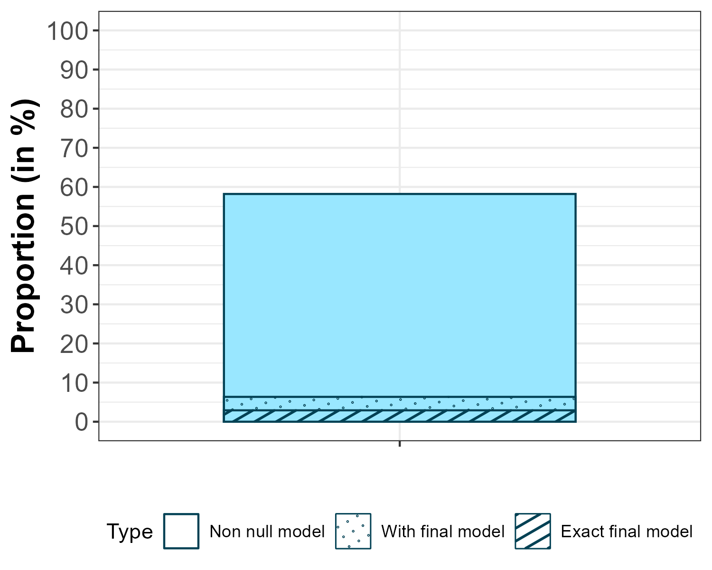
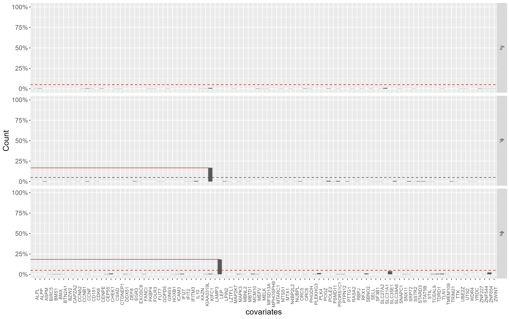

# Application to ZOSTAVAX data from the ImmuneSpace

```r
library(ggplot2)
library(dplyr)
library(plyr)
library(ggpattern)
library(stringr)
library(Biobase)
library(biomaRt)
dir <- function(d){if(!dir.exists(d)){dir.create(d)}}

genes_information <- read.table("data/GenesbyModules_Chaussabel_updateGeneNames.txt",header = TRUE)

T_cell = unlist(str_split(genes_information[genes_information$Function=="T cells","Genes"],", "))
B_cell = unlist(str_split(genes_information[genes_information$Function=="B cells","Genes"],", "))
Interferon = unlist(str_split(genes_information[genes_information$Function %in% c("Interferon","Type 1 Interferon"),"Genes"],", "))

data_elisa <- read.csv("data/raw/elisa.csv") # downloaded through ImmPort, not available in this repo 
data <- readRDS("data/raw/all_norm_withResponse_eset.rds") # downloaded through ImmPort, not available in this repo 
pdata <- pData(data)
pdata$age_reported <- as.numeric(pdata$age_reported)
gen <- exprs(data)

genes = rownames(gen)
```

We propose an illustration of the method on publicly available gene expression and immune response data. Our objective is to identify potential biomarkers involved in the immural immune response. Thus, we analyze data from a study on vaccine against Varicella Zoster virus, under the study accession number SDY984 -Zoster vaccine in young and elderly-, %, and vaccines against Meningococcal virus, under the study accession number SDY1260 -Correlation between human innate and adaptive immune responses to T-cell independent or dependent meningococcal vaccines. 
with all data are available and dowloaded from the ImmPort platform.  

We modelise the antibody production by considering two Antibodies secreting cells (ASC), denoted by S -for short-live- and L -for long-live- (at rates $\varphi_S$ and $\varphi_L$ resp.) and characterized by their half-life ($\delta_S$ and $\delta_L$ resp.). Antibodies are supposed to decay at rate $\delta_{Ab}$. The mechanistic model is then : 
```math
\forall i\leq N,j\leq n_i,   \left\{\begin{array}{rcl}
    \frac{d}{dt} Ab_i(t_{ij}) &=& {\varphi_S}_i e^{-\delta_S t_{ij}} + {\varphi_L}_i e^{-\delta_L t_{ij}} - {\delta_{Ab}}_i Ab_i(t_{ij}) \\
    Ab_i(t_{i0}=0) &=& {Ab_0}
\end{array}\right.
```
with 
```math
\displaystyle\left\{
\begin{array}{rcl}
         \log({\varphi_S}_i) &=& \log({\varphi_S}_{pop}) + \eta^{\varphi_S}_i \\
         \log({\varphi_L}_i) &=& \log({\varphi_L}_{pop})  + \eta^L_i \\
         \log({\delta_{S}}_i) &=& \log({\delta_{S}}_{pop})   +\eta^\delta}_i
    \end{array}\right.
    ```
where $\eta^{\varphi_S}_i\sim^{iid}\mathcal N(0,\omega_{\varphi_S}^2)$, $\eta^L_i\sim^{iid}\mathcal N(0,\omega_L^2)$, $\eta^{\delta}_i\sim^{iid}\mathcal N(0,\omega_{\delta}^2)$. The observation are the defined as 
```math
Y_{ij} = \log_{10}(Ab_i(t_{ij}))+\varepsilon_{ij}
```
where $\varepsilon_i\sim^{iid}\mathcal N(0,\Sigma=\sigma^2_{Ab}I_{n_i})$.

To conduct the selection, we focus on genes protein coding genes link to B cells, T cells, Interferon or Type 1 Interferon pathway according to Chaussabel classification and the BioBase database. 

Note that the code here are time consumming, and presented for lasso selection. To conduct the original stepAIC-SAMBA, p.max need to be set to his default value 0.1 and buildMethod to stepAIC. 

```r
ensembl <- useEnsembl(biomart = "genes")
ensembl <- useDataset(dataset = "hsapiens_gene_ensembl", mart = ensembl)

filter = getBM(
  mart = ensembl,
  attributes = c(
    "hgnc_symbol",
    "entrezgene_id",
    "ensembl_gene_id",
    "gene_biotype"),
  filters = "hgnc_symbol",
  values = genes,
  uniqueRows=TRUE)

keepGenes <- unique(filter[filter$gene_biotype=="protein_coding","hgnc_symbol"])
gen <- gen[keepGenes,]

data_elisa = merge(data_elisa,
                   unique(pdata[,c("participant_id","vaccine","pathogen","study_accession")]),
                   by.x="Participant.ID",by.y="participant_id")

cols=colnames(gen)
id=c(1:length(cols)) #store the personal identifier
date=c(1:length(cols)) #store the date of the sample
timepoint=c(1:length(cols)) #store the timepoint of the sample
for (i in c(1:length(cols))){
  id[i]=str_split(cols[i], "_")[[1]][1]
  date[i]=str_split(cols[i], "_")[[1]][2] # all days
  timepoint[i]=str_split(cols[i], "_")[[1]][4]
}

data_gen <- cbind(id,date,unit="Days",timepoint,t(gen)) %>% as.data.frame() %>%
  filter(id %in% data_elisa$Participant.ID)
rm("gen")

data_VAR <- data_elisa[data_elisa$pathogen=="Varicella Zoster",] %>% 
  mutate(Value.Preferred = as.numeric(Value.Preferred)) %>%
  mutate(Study.Time.Collected=as.numeric(Study.Time.Collected)) %>%
  arrange(Participant.ID,Study.Time.Collected)
# sapply(split(data_VAR$Participant.ID,data_VAR$Study.Time.Collected),FUN=function(x){length(unique(x))})
#   0   7  14  30  90 180 
#  35  35  35  35  35  33
id_VAR <- unique(data_VAR$Participant.ID)
# length(id_VAR)
# 35
gen_VAR <- data_gen[data_gen$id %in% id_VAR,]
# sapply(split(gen_VAR$id,gen_VAR$date),length)
#  0  1  3  7 
# 35 35 35 35 

# Plot imm
ggplot(data = data_VAR[data_VAR$Analyte=="IgG",],
       mapping = aes(x = Study.Time.Collected, y = log10(Value.Preferred),group=Participant.ID,color=vaccine))  +
  geom_line(alpha=0.7) +
  stat_summary(fun = mean, geom = "point", aes(group = vaccine), size = 1,color="brown") +  # Moyenne par temps
  stat_summary(fun = mean, geom = "line", aes(group = vaccine), linewidth = 0.7,color="brown") +
  stat_summary(fun.data = function(y) { 
    data.frame(ymin = mean(y) - sd(y), ymax = mean(y) + sd(y), y = mean(y)) 
  }, geom = "errorbar", aes(group = vaccine), color="brown",size=0.7) +
  theme (text = element_text(size=28),
         axis.text.y = element_text(hjust = 1, size=20), 
         axis.title= element_text (size=20),
         axis.text.x = element_text(angle = 45, hjust = 1, size=22),
         legend.position= "none",legend.text = element_text(size=18), 
         legend.title =element_text(size=20),
         strip.text = element_text(size=20, face="bold"),
         plot.background = element_rect(fill='transparent', color=NA),
         legend.background = element_rect(fill='transparent'),
         legend.box.background = element_rect(fill='transparent'))+
  ylab ("log10(Ab)")+
  xlab("time (in days)")

df <- data_VAR %>%
  filter(Analyte=="IgG") %>%
  dplyr::select(Participant.ID,Study.Time.Collected,Value.Preferred) %>%
  mutate(Value.Preferred = log10(Value.Preferred)) %>%
  unique() %>%
  arrange(Participant.ID,Study.Time.Collected)
colnames(df) <- c("ID","Time","Value")
init = df[df$Time==0,c("ID","Value")]
colnames(init)[2] <- c("Init")
df <- merge(df,init,by="ID")

write.csv(df,file="data/applicationFiles/Imm_data.txt",quote = F,row.names = F)

gen_J = gen_VAR[gen_VAR$date==1,-c(2,3,4)]
df_J = merge(df,dplyr::select(gen_J,id,any_of(T_cell),any_of(B_cell),any_of(Interferon)),by.x="ID",by.y="id")


Nb_cov = ncol(df_J_mix)-4

write.csv(df_J_mix,file="data/applicationFiles/data.txt",quote = F,row.names = F)
```


```r
source("scripts/MBFun.R")
pathToResults = paste0("outputs/buildingResults/application")
dir(pathToResults)


newProject(modelFile = "data/modelFiles/PasinApp.txt",
             data = list(dataFile="data/applicationFiles/data.txt",
                         headerTypes = c("id","time","observation","regressor",rep("contcov",Nb_cov))))
  
  setIndividualParameterVariability(delta_L=FALSE)
  setPopulationParameterInformation(delta_L_pop=list(initialValue=log(2)/(10*365),method="FIXED"))
  
  setIndividualParameterVariability(delta_AB=FALSE)
  setPopulationParameterInformation(delta_AB_pop=list(initialValue=log(2)/11,method="FIXED"))
  
  setErrorModel(Value="constant")
  
  saveProject(paste0(temporaryDirectory,"/Build.mlxtran"))
  # buildmlx ---------------------------------------------------------
  res = buildmlx(project = paste0(temporaryDirectory,"/Build.mlxtran"),
                 buildMethod = "lasso",
                 model=model,
                 test=FALSE,
                 FDP_thr = 0.2,
                 p.max=1)
  
  Model <- Rsmlx:::mlx.getIndividualParameterModel()
  covModel <- lapply(Model$covariateModel,FUN=function(cov){names(cov[which(cov)])})
  time=res$time
  iter=res$iter
  
  save(res,Model,covModel,time,iter,file=paste0(pathToResults,"/lasso.RData"))
```

We also conduct the selection over 500 bootstrap to test the stability of selected and non selected genes. 

```r
set.seed(1710)
seed = floor(runif(1000)*100000)
nb_bootstrap <- 500

sim <- read.csv("data/applicationFiles/data.txt")
dir.create("data/applicationFiles/bootstrap")
write.csv(sim,file="data/applicationFiles/bootstrap/bootstrap_0.txt",quote = FALSE,row.names = FALSE)

pid <- unique(sim$ID)
for(i in 1:nb_bootstrap){
  set.seed(seed[i])
  sampled_id <- sample(pid,replace = TRUE)
  
  new_id <- 1:length(pid)

  new_sim <- data.frame()
  for(k in 1:length(pid)){
    isolate_id <- sim %>% filter(ID==sampled_id[k]) %>% mutate(ID=k)

    new_sim <- rbind(new_sim,isolate_id)
  }
  write.csv(new_sim,file=paste0("data/applicationFiles/bootstrap/bootstrap_",i,".txt"),quote = FALSE,row.names = FALSE)
}
```

```r
arr = 1

pathToResults = paste0("outputs/buildingResults/application/bootstrap")
dir(pathToResults)
pathToResults = paste0(pathToResults,"/bootstrap_",arr,".RData")

newProject(modelFile = "data/modelFiles/PasinApp.txt",
           data = list(paste0(dataFile="data/applicationFiles/bootstrap/bootstrap_",arr,".txt"),
                       headerTypes = c("id","time","observation","regressor",rep("contcov",nbCov))))

setIndividualParameterVariability(delta_L=FALSE)
setPopulationParameterInformation(delta_L_pop=list(initialValue=log(2)/(10*365),method="FIXED"))
setIndividualParameterVariability(delta_AB=FALSE)
setPopulationParameterInformation(delta_AB_pop=list(initialValue=log(2)/11,method="FIXED"))
setErrorModel(Value="constant")

# buildmlx ---------------------------------------------------------
res = buildmlx(buildMethod = "lasso",
               model='covariate',
               test=FALSE,
               FDP_thr = 0.20,
               p.max=1)

Model <- Rsmlx:::mlx.getIndividualParameterModel()
covModel <- lapply(Model$covariateModel,FUN=function(cov){names(cov[which(cov)])})
time=res$time
iter=res$iter

save(res,Model,covModel,time,iter,file=pathToResults)
```

Results from the bootstraped selection can be visualized by codes bellow, which render the following plots.

<p align="center">
  
</div>

<p align="center">
  
</div>

```r
results <- data.frame()
NB_mod <- 0
for(i in 1:500){
    tryCatch({
      load(paste0("outputs/buildingResults/bootstrap/bootstrap_",i,".RData"))
      NB_mod[as.character(r)] <-NB_mod[as.character(r)]+1
      
      if(length(unlist(covModel))!=0){
        results <- rbind(results,data.frame(model=i,parameter=rep(names(covModel),sapply(covModel,length)),covariates=unname(unlist(covModel))))
      }},error=function(e){print(i)})
  }

results[results$parameter=="phi_S","parameter"] <- latex2exp::TeX(r"($\varphi_S$)",output="character")
results[results$parameter=="phi_L","parameter"] <- latex2exp::TeX(r"($\varphi_L$)",output="character")
results[results$parameter=="delta_S","parameter"] <- latex2exp::TeX(r"($\delta_S$)",output="character")


# sapply(sort(sapply(unique(results$covariates),FUN=function(x){round(length(unique(results[results$covariates==x,"model"]))/NB_mod*100,digits=2)})),FUN=function(x){paste0(x,"%")})
# 
# lapply(split(results,results$rate),FUN=function(results){
# lapply(split(results,results$parameter),FUN=function(df){
#   sapply(sort(sapply(unique(df$covariates),FUN=function(x){round(length(unique(df[df$covariates==x,"model"]))/NB_mod*100,digits=2)})),FUN=function(x){paste0(x,"%")})
# })
# })


value <- data.frame(Type=c("non null model"),
                    Value=length(unique(results[,"model"]))/NB_mod*100)

colFonce = c("#5c6e39","#563f61","#703527","#024154","#524b43")[1:length(rate)]
col = c("#a6c46a","#8e6aa0","#ee6c4d","#007194","#9D8F80","#FFD447")[1:length(rate)]
colpas = c("#e0e6c6","#d0c1d7","#f8c2b4","#99e7ff","#cac2ba","#ffe591")[1:length(rate)]

ggplot(mapping=aes(x=rate,y=Value,pattern=Type)) +
  geom_col(data=value[value$Type=="non null model",], width = 0.7, position = position_dodge(width = 0.7),color="black",alpha=0.7)  +
  geom_bar_pattern(data=value[value$Type=="CCDC106 selected among others",], position="dodge",width=0.7,color="black",pattern_fill="black",pattern_density=0.05,pattern_spacing=0.025,stat='identity',pattern="circle",alpha=0.7)+
  geom_bar_pattern(data=value[value$Type=="Only CCDC106 selected",], position="dodge",width=0.7,color="black",pattern_fill="black",pattern_density=0.05,pattern_spacing=0.025,stat='identity',pattern="stripe",alpha=0.7) +
  labs( y = "Proportion (in %)") +
  scale_y_continuous(breaks=seq(0,100,10),limits = c(0,100))+
  theme(axis.text.x = element_text(size = 10))+
  theme(axis.text.y = element_text(size = 8))+
  theme(axis.title = element_text(size=12))+
  theme(strip.text = element_text(size = 12))+
  theme(plot.subtitle = element_text(size=12))+
  theme(plot.title = element_text(size=16,color="#ee6c4d"))+
  guides(fill = "none") +
  theme(legend.position = "bottom")

ggsave(filename = "outputs/figures/applicationResults/propModel.png")

ggplot(results,aes(x=covariates))+geom_bar()+facet_grid(parameter~.,labeller=label_parsed)+ylim(c(0,500))+theme(axis.text.x = element_text(angle = 90))+
  geom_hline(yintercept = 25, color = "brown", linetype = "dashed") +
  # geom_segment(data = subset(results, parameter == "varphi[S]"), 
  #              aes(x = 0, xend = 11.5, 
  #                  y = 105, yend = 105), 
  #              color = "red3", linetype = "solid", size = 0.5) + 
  ylab("Count")


ggsave(filename = "outputs/figures/applicationResults/countModel.png")
```