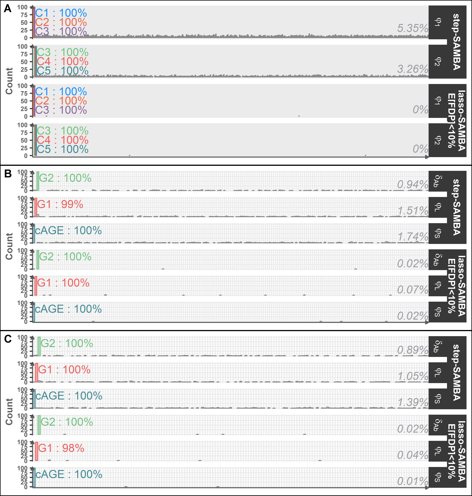

# Article figures 

```r
library(ggplot2)
library(ggpubr)
library(dplyr)
library(ggpattern)
library(webshot2)
library(ggh4x)
library(flextable)
library(grid)
library(gtable)
library(gridExtra)
library(scales)
sapply(list.files("scripts/resultsFun/graphsFun",full.names = T),FUN=function(d){source(d,echo=F)})
source("scripts/resultsFun/graphs.R")

pN0 = graphsGenerate(project="Naveau",buildMethod = c("stepAIC","lassoFDP10"),JPEG = T,PNG=T)
pP = graphsGenerate(project="Pasin",buildMethod = c("stepAIC","lassoFDP10"),JPEG = T,PNG=T)
pG = graphsGenerate(project="GaussianPasin",buildMethod = c("stepAIC","lassoFDP10"),JPEG = T,PNG=T)

pN = graphsGenerate(project=c("Naveau"),buildMethod = c("stepAIC","lassoFDP10","SAEMVS"),JPEG = T,PNG=T)

pN_all = graphsGenerate(project="Naveau",buildMethod = c("stepAIC","lassoFDP5","lassoFDP10","lassoFDP20"),JPEG = T,PNG=T)
pP_all = graphsGenerate(project="Pasin",buildMethod = c("stepAIC","lassoFDP5","lassoFDP10","lassoFDP20"),JPEG = T,PNG=T)
pG_all = graphsGenerate(project="GaussianPasin",buildMethod = c("stepAIC","lassoFDP5","lassoFDP10","lassoFDP20"),JPEG = T,PNG=T)

# en noir et blanc 
bw <- function(p){
  for (i in seq_along(p$layers)) {
    p$layers[[i]]$mapping$colour <- NULL
    p$layers[[i]]$mapping$fill <- NULL
    p$layers[[i]]$aes_params$colour <- "black"
    p$layers[[i]]$aes_params$fill <- "grey"
}
return(p)
}
```


```r
ggarrange(pN$StatsComp+theme(axis.title.x = element_blank(),
                             plot.background = element_rect(linewidth=0.7,color="black"))+
                             scale_fill_manual(values=c("stepAIC"="grey","lassoFDP10"="grey","SAEMVS"="grey"),guide="none"),
          pG$StatsComp+theme(axis.title.x = element_blank(),
                             plot.background = element_rect(linewidth=0.7,color="black"))+
                             scale_fill_manual(values=c("stepAIC"="grey","lassoFDP10"="grey"),guide="none"),
          pP$StatsComp+theme(axis.title.x = element_blank(),
                             plot.background = element_rect(linewidth=0.7,color="black"))+
                             scale_fill_manual(values=c("stepAIC"="grey","lassoFDP10"="grey"),guide="none"),
          nrow=1,common.legend=TRUE,legend="bottom",labels=c("A","B","C"),widths=c(1.3,1,1))

ggsave("outputs/figures/finalFigures/Figure1.eps",
       height=3,width=9,device=cairo_ps)

```
The following graphs is the colored figure generated by in black and white by the code below.

<p align="center">

</p>

<p align="center"><strong>Figure 1:</strong> Proportion of exact models (no false positives or false negatives) and models that strictly including the exact model (no false negatives but with false positives). (A) Pharmacokinetics model with categorical covariates; (B) Vaccinology framework with Gaussian-correlated covariates; (C) Vaccinology framework with randomly drawn covariates.</p>

```r
ggarrange(pN0$ParComp+theme(plot.background = element_rect(linewidth=0.7,color="black")),
          pG$ParComp+theme(plot.background = element_rect(linewidth=0.7,color="black")),
          pP$ParComp+theme(plot.background = element_rect(linewidth=0.7,color="black")),
          ncol=1,labels=c("A","B","C"),heights = c(1,1,1))
          
ggsave("outputs/figures/finalFigures/Figure2_colored.eps",
       width = 8.33, height = 8.75,units="in",device=cairo_ps)

```

```r
ggarrange(bw(pN0$ParComp+theme(plot.background = element_rect(linewidth=0.7,color="black"))),
          bw(pG$ParComp+theme(plot.background = element_rect(linewidth=0.7,color="black"))),
          bw(pP$ParComp+theme(plot.background = element_rect(linewidth=0.7,color="black"))),
          ncol=1,labels=c("A","B","C"),heights = c(1,1,1))
          
ggsave("outputs/figures/finalFigures/Figure2.eps",
       width = 8.33, height = 8.75,units="in",device=cairo_ps)

```

<p align="center">

</p>

<p align="center"><strong>Figure 2:</strong> Covariate selection frequency across simulation frameworks for the original method (stepAIC with statistical tests at each iteration) and the lasso approach, with an error control threshold of 10%. The mean selection frequency of false discoveries is displayed on the right of each histogram. (A) Pharmacokinetics model with categorical covariates; (B) Vaccinology framework with Gaussian-correlated covariates; (C) Vaccinology framework with randomly drawn covariates.</p>

```r

load(file="outputs/buildingResults/application/bootstrap.RData")

value$Type <- factor(value$Type,levels=c("Non null model","With final model","Exact final model"))
value.par$Type <- factor(value.par$Type,levels=c("Only final gene selected","Final gene selected among others","Non null model"))


plots <- lapply(split(results,results$method),FUN=function(results){
  method=unique(results$method)
  
  write_lasso = data.frame(parameter = c("delta[S]","varphi[S]","varphi[L]"),
                     text = c("",paste0(c("LEP : ","KIFC1 :"),round(c(length(unique(results[results$parameter=="varphi[S]" & results$covariates=="LEP","model"])),
                                          length(unique(results[results$parameter=="varphi[L]" & results$covariates=="KIFC1","model"])))/NB_mod[[method]]*100,digits=1),"%")),
                     coory=c(10,c(length(unique(results[results$parameter=="varphi[S]" & results$covariates=="LEP","model"])),
                                        length(unique(results[results$parameter=="varphi[L]" & results$covariates=="KIFC1","model"])))),
                     coorx=c(0,0,0))
  
  covariates = results %>% select(parameter,covariates) %>% unique() %>% arrange(parameter,covariates)
  fill <- rep("grey61",nrow(covariates))
  
  fill[which(covariates$parameter=="delta[S]" & covariates$covariates %in% covModel$delta_S)] <- "tomato"
  fill[which(covariates$parameter=="varphi[S]" & covariates$covariates %in% covModel$phi_S)] <- "tomato"
  fill[which(covariates$parameter=="varphi[L]" & covariates$covariates %in% covModel$phi_L)] <- "tomato"
  fill[which(covariates$parameter=="varphi[S]" & covariates$covariates=="LEP")] <- "darkred"
  fill[which(covariates$parameter=="varphi[L]" & covariates$covariates=="KIFC1")] <- "darkred"
  
  write <- data.frame(
                   parameter = rep("delta[S]",sum(covariates$parameter=="delta[S]" & covariates$covariates %in% covModel$delta_S)),
                   covariates = covariates$covariates[(covariates$parameter=="delta[S]" & covariates$covariates %in% covModel$delta_S)],
                   text=paste0(covariates$covariates[(covariates$parameter=="delta[S]" & covariates$covariates %in% covModel$delta_S)]," : ",sapply(covariates$covariates[(covariates$parameter=="delta[S]" & covariates$covariates %in% covModel$delta_S)],FUN=function(g){round(length(unique(results[results$parameter=="delta[S]" & results$covariates==g,"model"]))/NB_mod[[method]]*100,digits=1)}),"%"),
                   coorx = which(covariates[covariates$parameter=="delta[S]","covariates"] %in% covariates$covariates[(covariates$parameter=="delta[S]" & covariates$covariates %in% covModel$delta_S)]),
                   coory = sapply(covariates$covariates[(covariates$parameter=="delta[S]" & covariates$covariates %in% covModel$delta_S)],FUN=function(g){length(unique(results[results$parameter=="delta[S]" & results$covariates==g,"model"]))})
                 )
  write <- rbind(write,
                 data.frame(
                   parameter = rep("varphi[S]",sum(covariates$parameter=="varphi[S]" & covariates$covariates %in% covModel$phi_S)),
                   covariates = covariates$covariates[(covariates$parameter=="varphi[S]" & covariates$covariates %in% covModel$phi_S)],
                   text=paste0(covariates$covariates[(covariates$parameter=="varphi[S]" & covariates$covariates %in% covModel$phi_S)]," : ",sapply(covariates$covariates[(covariates$parameter=="varphi[S]" & covariates$covariates %in% covModel$phi_S)],FUN=function(g){round(length(unique(results[results$parameter=="varphi[S]" & results$covariates==g,"model"]))/NB_mod[[method]]*100,digits=1)}),"%"),
                   coorx = which(covariates[covariates$parameter=="varphi[S]","covariates"] %in% covariates$covariates[(covariates$parameter=="varphi[S]" & covariates$covariates %in% covModel$phi_S)]),
                   coory = sapply(covariates$covariates[(covariates$parameter=="varphi[S]" & covariates$covariates %in% covModel$phi_S)],FUN=function(g){length(unique(results[results$parameter=="varphi[S]" & results$covariates==g,"model"]))})
                 ))
  write <- write[-which(write$parameter=="varphi[S]" & stringr::str_detect(write$text,"LEP")),]
  write <- rbind(write,
                 data.frame(
                   parameter = rep("varphi[L]",sum(covariates$parameter=="varphi[L]" & covariates$covariates %in% covModel$phi_L)),
                   covariates = covariates$covariates[(covariates$parameter=="varphi[L]" & covariates$covariates %in% covModel$phi_L)],
                   text=paste0(covariates$covariates[(covariates$parameter=="varphi[L]" & covariates$covariates %in% covModel$phi_L)]," : ",sapply(covariates$covariates[(covariates$parameter=="varphi[L]" & covariates$covariates %in% covModel$phi_L)],FUN=function(g){round(length(unique(results[results$parameter=="varphi[L]" & results$covariates==g,"model"]))/NB_mod[[method]]*100,digits=1)}),"%"),
                   coorx = which(covariates[covariates$parameter=="varphi[L]","covariates"] %in% covariates$covariates[(covariates$parameter=="varphi[L]" & covariates$covariates %in% covModel$phi_L)]),
                   coory = sapply(covariates$covariates[(covariates$parameter=="varphi[L]" & covariates$covariates %in% covModel$phi_L)],FUN=function(g){length(unique(results[results$parameter=="varphi[L]" & results$covariates==g,"model"]))})
                 ))
  write <- write[-which(write$parameter=="varphi[L]" & stringr::str_detect(write$text,"KIFC1")),]
  
  write <- write[write$coory>=25,]
  
  plot <- ggplot(results,aes(x=covariates))+geom_bar(fill=fill,color=fill)+
      facet_grid(parameter~.,labeller=label_parsed)+
      theme(axis.text.x = element_text(angle = 90))+
      geom_hline(yintercept = 0.05*NB_mod[[method]], color = "tomato", linetype = "dashed") +
      geom_segment(data = subset(results, parameter == "varphi[S]"),
                   aes(x = 0, xend = which(sort(unique(results$covariates))=="LEP"),
                       y = length(unique(results[results$parameter=="varphi[S]" & results$covariates=="LEP","model"])),
                       yend = length(unique(results[results$parameter=="varphi[S]" & results$covariates=="LEP","model"]))),
                   color = "darkred", linetype = "solid", size = 0.5) +
      geom_segment(data = subset(results, parameter == "varphi[L]"),
                   aes(x = 0, xend = which(sort(unique(results$covariates))=="KIFC1"),
                       y = length(unique(results[results$parameter=="varphi[L]" & results$covariates=="KIFC1","model"])),
                       yend = length(unique(results[results$parameter=="varphi[L]" & results$covariates=="KIFC1","model"]))),
                   color = "darkred", linetype = "solid", size = 0.5) +
      geom_text(data=write_lasso,aes(label=text,y=coory,x=coorx,color="LS"),hjust=-0.5,vjust = -0.5,size=5)+
      geom_text(data=ifelse(nrow(write)==0,data.frame(parameter="delta[S]",text="",coory=10,coorx=0),write),aes(label=text,x=covariates,color="S"),y=30,hjust=0.8,vjust = -0.8,size=5)+
      ylab("Proportion") +
      scale_y_continuous(limits = c(0,NB_mod[[method]]),
                         breaks = seq(0,NB_mod[[method]],NB_mod[[method]]/4), 
                         labels = scales::percent(seq(0,1,0.25)))+
      theme(axis.title=element_text(size=15),
            axis.text.y = element_text(size=12),
            axis.text.x = element_blank(),
            strip.text = element_text(size = 20),
            plot.background = element_rect(fill='transparent', color=NA), 
            legend.key = element_rect(fill = "transparent", color = NA),
            legend.background = element_rect(fill = "transparent", color = NA),
            legend.position="bottom",
            # legend.direction = "vertical",
            legend.box="vertical",
            panel.grid.major.x = element_blank(),
            panel.grid.minor.x = element_blank()) +
      scale_color_manual(name="",values=c("LS"="darkred","S"="tomato"),labels=c("LS"="selected by lasso- and stepAIC-SAMBA;","S"="selected by stepAIC-SAMBA only.")) +
      guides(color = guide_legend(override.aes = list(label = "Genes", size = 4,vjust=0.5),label.theme=element_text(margin=margin(l=0.5),size=14)))
  
  if(PNG){
    ggsave(plot,filename = paste0("outputs/figures/applicationResults/countModel_",method,".png"),unit="px",width=7000,height=2800,dpi=600, bg='transparent',device=grDevices::png)
  }
  if(JPEG){
    ggsave(plot,filename = paste0("outputs/figures/applicationResults/countModel_",method,".jpeg"),unit="px",width=7000,height=2800,dpi=600,device=grDevices::jpeg)
  }
  ggsave(plot,filename = paste0("outputs/figures/applicationResults/countModel_",method,".eps"),device="eps",width=12,height=4.5)
  
  return(plot)
})

plot <-
  ggarrange(plots$stepAIC +theme(
    plot.background = element_rect(color = "black", size = 0.7, fill = "white")
  ), plots$lasso+ theme(
    plot.background = element_rect(color = "black", size = 0.7, fill = "white")
  ), ncol = 1, nrow = 2,labels = c("A","B"),common.legend=TRUE,legend="bottom")


ggsave(plot,filename = paste0("outputs/figures/finalFigures/Figure3.eps"),device="eps",width=12,height=8)

```

<p align="center">

</p>

<p align="center"><strong>Figure 3:</strong> Bootstrap selection frequencies for covariates across all parameter models. The top
panel shows results for the stepAIC-SAMBA procedure (493 successful runs), and the bottom
panel for the lasso-SAMBA procedure (500 runs). Selection frequencies above 5% of selected
genes by any of the procedure are indicated.</p>