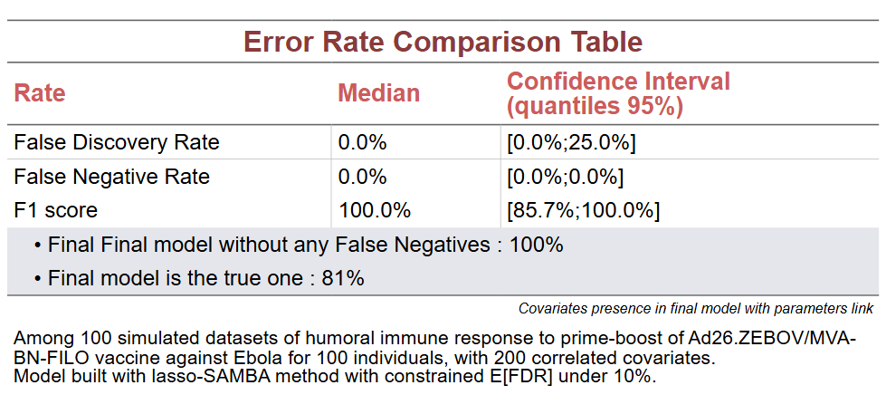
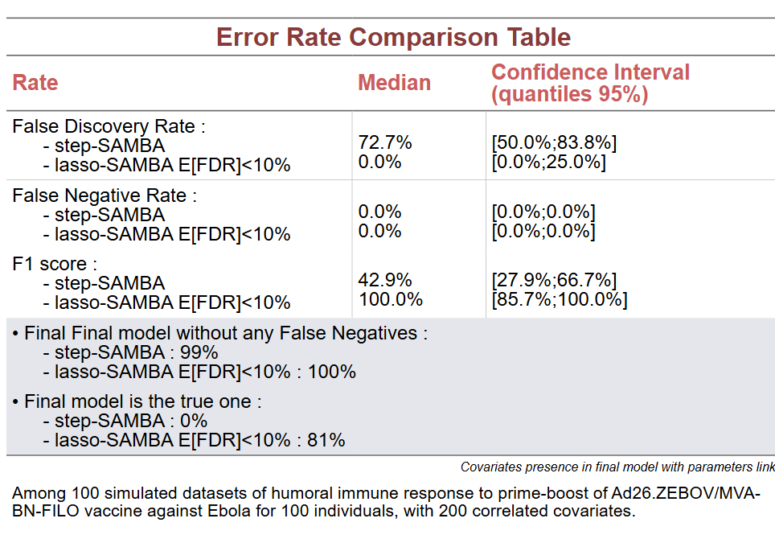

# Supporting information

<!-- badges: start -->
<!-- badges: end -->
<!--ts-->
* [Generation of an example](#sgeneration-of-an-example)
* [Application of SAEMVS on a detailed example](#application-of-saemvs-on-a-detailed-example)
   * [Model simulation](#model-simulation)
   * [Convergence of the MCMC-SAEM algorithm](#convergence-of-the-mcmc-saem-algorithm)
   * [Spike-and-slab regularisation plot and model selection](#spike-and-slab-regularisation-plot-and-model-selection)
<!--te-->

This repository contains....

``` r
rm(list = ls())
set.seed(1710)
dir <- function(path){if(!dir.exists(path)){dir.create(path)}}

library(dplyr)
library(ggplot)
library(lixoftConnectors)
  
initializeLixoftConnectors("simulx")
```

# Generation of an example

As an example, we simulate the humoral immune response 7 days after a boost of vaccine against Ebola, using Pasin et al. [[1]](#1) model and Alexandre et al. [[2]](#2) values parameters estimated from Ebovac clinical trial.

We simulate for 100 individuals the antibody production by considering two Antibodies secreting cells (ASC), denoted by S -\textit{for short-live}- and L -\textit{for long-live}- (at rates $\varphi_S$ and $\varphi_L$ resp.) and characterized by their half-life ($\delta_S$ and $\delta_L$ resp.). Antibodies are supposed to decay at rate $\delta_{Ab}$. We add significant covariates on $\varphi_S$, $\varphi_L$ and $\delta_{Ab}$ parameters. The mechanistic model is then : 
```math 
\forall i\leq N,j\leq n_i,   \left\{\begin{array}{rcl}
    \frac{d}{dt} Ab_i(t_{ij}) &=& {\varphi_S}_i e^{-\delta_S t_{ij}} + {\varphi_L}_i e^{-\delta_L t_{ij}} - {\delta_{Ab}}_i Ab_i(t_{ij}) \\
    Ab_i(t_{i0}=0) &=& {Ab_0}
\end{array}\right.
```
with 
```math
 \displaystyle\left\{
\begin{array}{rcl}
         \log({\varphi_S}_i) &=& \log({\varphi_S}_{pop}) + \eta^{\varphi_S}_i \\
         \log({\varphi_L}_i) &=& \log({\varphi_L}_{pop})  + \eta^L_i \\
         \log({\delta_{Ab}}_i) &=& \log({\delta_{Ab}}_{pop})   +\eta^{Ab}_i
    \end{array}\right. 
```
where
```math
\displaystyle\left\{
\begin{array}{rcl}
\eta^{\varphi_S}_i&\overset{iid}{\sim}&\mathcal N(0,\omega_{\varphi_S}^2) \\
\eta^L_i&\overset{iid}{\sim}&\mathcal N(0,\omega_L^2) \\
\eta^{Ab}_i&\overset{iid}{\sim}&\mathcal N(0,\omega_{Ab}^2)
    \end{array}\right. 
```
The observation are the defined as 
$Y_{ij} = log_{10}(Ab_i(t_{ij}))+\varepsilon_{ij}$
where 
```math 
\varepsilon_i\overset{iid}{\sim}\mathcal N(0,\Sigma=\sigma^2_{Ab}I_{n_i})
```.
We then add to the dataset noisy genes in order to have finally 200 covariates. These covariates are correlated gaussian covariates. To generate the correlation, we use the estimate of the covariance matrix of genomics measurement from Prevac-UP trial [[3]](#3) at D63 using Spearman method, in order to have realistic correlation between our covariates (including the significant one). This covariance matrix as well as the correlation matrix is saved in the `distribPasin.RData` object. 

``` r
nb_ind <- 100
nb_cov <- 200

load("data/simulationSetup/distribPasin.RData")
loadProject("data/simulationSetup/Pasin.smlx")
```

The project based of this mechanistic model has been created in the Simulx software [[4]](#4), with the values parameter from Alexandre et al.

``` r
getPopulationElements()$PopParameters$data
getOutputElements()$outputManual1$data
```

The covariates has been estimated using normal distribution with the covariance matrix and mean values estimated from PREVAC-up clinical trial as explained above :

```r
covTable = as.data.frame(mvtnorm::rmvnorm(n=nb_ind,mean=mu,sigma = genCovMat))
head(covTable[,1:6])
colnames(covTable) <- c("AGE","G1","G2",paste0("Gen",1:(nb_cov-3)))
covTable <- cbind(id=1:nb_ind,covTable)

write.csv(covTable[,1:4],paste0("tmpfile.txt"),quote = F,row.names = F) # for the simulation, we only need id, AGE, G1 and G2

defineCovariateElement(name=paste0("covTable"),
                         element = paste0("tmpfile.txt"))

setGroupElement(group=paste0("simulationGroup1"), elements = c(paste0("covTable")))
runSimulation()
sim <- getSimulationResults()
head(sim$res$yAB)
ggplot(sim$res$yAB,aes(x=time,group=as.factor(id),color=as.factor(id),y=yAB))+geom_line()+theme(legend.position="none") + ggtitle("Simulation of humoral immune response to ad26/MVA vaccine from 7 days after boost",subtitle="for 100 individuals.")+ylab("log10(Ab)")+xlab("time (days)")
```

Once the simulation launch, data files are saved for further analyzis. As it is usually done before analyzis, the age of participants is centered.

```r
dataset = sim$res$yAB[,c("id","time","yAB")]
  
covTable = covTable %>% 
    mutate(AGE = AGE - mean(covTable$AGE)) %>%
    rename(cAGE = AGE)
  
dataset = merge(dataset,covTable,by = "id")
dataset$id <- as.numeric(dataset$id)
dataset = dataset %>% arrange(id,time)
  
write.csv(covTable,file=paste0("data/simulationFiles/FilesGaussianPasin/covTable/covTable_1.txt"),quote = F,row.names = F) 
write.csv(dataset,file=paste0("data/simulationFiles/FilesGaussianPasin/simulation/simulation_1.txt"),quote = F,row.names = F)
  
unlink(paste0("tmpfile.txt"))

headerTypes = c("id","time","observation",rep("contcov",nb_cov))
save(headerTypes,file="data/simulationFiles/FilesGaussianPasin/headerTypes.RData")
```

# lasso-SAMBA algorithm for a replicates 

To build the model, we will use Monolix software [[5]](#5) and the Rsmlx package [[6]](#6) (containing implemented SAMBA algorithm [[7]](#7)) from which we had several other function to enable our lasso approach. 
``` r
library(lixoftConnectors)
library(foreach)
initializeLixoftConnectors(software = "monolix",force=TRUE)

# Function just modified
source("scripts/modelBuildingFun/buildmlx.R")
source("scripts/modelBuildingFun/covariateModelSelection.R")
source("scripts/modelBuildingFun/covariateModelSelection.reg.R")

# Function implemented
source("scripts/modelBuildingFun/modelFromSelection.R")
source("scripts/modelBuildingFun/updateCov0.R")
source("scripts/modelBuildingFun/covariateModelSelection.lasso.R")
source("scripts/modelBuildingFun/applyMethodLasso.R")

# Folder and paths
dir("outputs/buildingResults/")
dir("outputs/buildingResults/simulation")
pathToResults = paste0("outputs/buildingResults/simulation/Results",project)
dir(pathToResults)
pathToResults = paste0(pathToResults,"/Results_",buildMethod,if(buildMethod=="lasso"){paste0("FDP",FDP_thr*100)})
dir(pathToResults)

pathToFolderResults = pathToResults
pathToCompResults=paste0(pathToResults,"/compResults_",arr,".RData")
pathToResults=paste0(pathToResults,"/buildResults_",arr,".RData")

# Temporary Files :
temporaryDirectory = paste0("tmp",arr,project,buildMethod,paste0("FDP",FDP_thr*100))
if(dir.exists(temporaryDirectory)){
  warning("A folder already exists for this job. It has been deleted.")
  unlink(temporaryDirectory,recursive=T,force=T)
}
dir.create(temporaryDirectory)
```

We then create the Monolix project containing the simulated dataset created. 

```r 
pathToSim = "data/simulationFiles/FilesGaussianPasin/simulation/simulation_1.txt")
load("data/simulationFiles/FilesGaussianPasin/headerTypes.RData")

newProject(data = list(dataFile = pathToSim,
                           headerTypes = headerTypes),
               modelFile = "data/modelFiles/Pasin.txt")
```

For identifiability issue, we fixe parameter $delta_S$ and $delta_L$ to their value, and set the error model to constant. 

```r
obs.name=getMapping()$mapping[[1]]$model
eval(parse(text=paste0("setErrorModel(",obs.name,"='constant')")))
    
setIndividualParameterVariability(delta_S=FALSE,delta_L=FALSE)
setPopulationParameterInformation(
      delta_S_pop=list(initialValue=0.23,method="FIXED"),
      delta_L_pop=list(initialValue=0.000316,method="FIXED"))
      
saveProject(projectFile=paste0(temporaryDirectory,"/Build.mlxtran"))
```
We can now launch the building process. The default argument are `FDP_thr=0.1` for the bound on the expected number of false postive used to do the lasso selection enhanced by stability selection at each iteration. We discuss this thresholds in the Supplementary Material with additional graphs, but in overall, we find that 0.05 is too restrictive as we start with a wrong model to move towards a better one, and the results of the algorithm does not depend heavily on this hyperparameters. We also set `p.max` to 1, this argument control for the thresholds above which we remove permanently a covariate from the process before doing the stepAIC regression and so it is not part of the lasso approach. Finaly, `test` is set to `FALSE` to remove the final statistic test to search for additional or superfluous covariates. What we are interested in is the direct output of our lasso approach, whithout further analyzis. 

```r
res = buildmlx(project = paste0(temporaryDirectory,"/Build.mlxtran"),
                 buildMethod = "lasso",
                 model='covariate',
                 test=FALSE)
                 
getIndividualParameterModel()                 
```

# Run on every replicates 

The results for the model building process over 100 replicates for either the stepAIC method or the lasso one (with FDP<0.05, 0.10 or 0.20) is summarize in the following object.

```r
load("outputs/finalResults/BuildResults_GaussianPasin.RData")
```

This object contain :

* `computationStats` : for each method (stepAIC, lasso0.05, lasso0.10, lasso0.20) and each replicates, the time of computation and number of iteration ; 

* `CovariateModelSelection` : the relationship between parameters and covariates for each method and replicates. 

* `errorStatsPar` : FP, FN, TP, TN, FDR and FNR score computed for each parameter model, replicates and method. 

* `likelihoodSats` : OFV, AIC, BIC, BICc computed for each replicates and method tested.

* `resultCovariatePar` : for each parameter-covariate relationship, the number of times selected through the replicates for each method. 

* `resultModelPar` : for each method tested, the number of exact model and overselected model found over the replicates. 

* `orderList` : (for graphical purpose) the order of the covariates to display in a x-axis if necessary (this is used in order to constrain the significative covariates in first place).

We also use two objects added in the simulationFiles folder to retrieve information from the simulation setup (such as the number of individuals, the number of covariates, the true relationship and information about the simulation framework)

```r
cat(paste0(readLines("data/simulationFiles/FilesGaussianPasin/info.txt"),collapse="\n"))
```

## Results graphs

```r
library(ggplot2)
library(ggpubr)
library(dplyr)
library(ggpattern)
library(webshot2)
library(ggh4x)
library(flextable)
library(grid)
library(gtable)
library(gridExtra)
library(scales)
sapply(list.files("scripts/resultsFun/graphsFun",full.names = T),FUN=function(d){source(d,echo=F)})
```

Function loaded are : 
* `graphsParNB` : for description of a single method, display the proportion of selection of each covariates with each parameters over the replicates.

<div style="text-align: center;">
  
</div>

* `tableStats` : for description of a single method, resume in a table the scores measure (FDR, FNR and F1_score) for the method, with number of exact and overselective model.

<div style="text-align: center;">
  
</div>

* `graphsCompTime` : display the distribution of the computation time and iteration for several methods.

<div style="text-align: center;">
   
</div>

* `graphsLL` : display the distribution of OFV, AIC, BIC and BICc for several methods.

<div style="text-align: center;">
  
</div>

* `graphsParCompMethod` : display the proportion of selection of each covariates with each parameters over the replicates, for several methods.

<div style="text-align: center;">
  
</div>

* `graphsStatsComp` : display the proportion of exact and overselective model over the replicates for several methods.

<div style="text-align: center;">
  
</div>

* `tableStatsComp` : resume in a table the scores measure (FDR, FNR and F1_score) for the method, with number of exact and overselective model, for several methods.

<div style="text-align: center;">
  
</div>


All of these functions are use in the single function `graphsGenerate` that take into argument the simulation framework name (either "Pasin", "GaussianPasin" or "Naveau", here "GaussianPasin"), the method, and if the pictures should be saved in PNG or JPEG format (or both). These graphs have been generated doing : 
```r 
graphsGenerate(project="GaussianPasin",buildMethod = c("stepAIC","lassoFDP10"),JPEG = F,PNG=T)
```


## References
<a id="1">[1]</a> 
Pasin CBalelli IVan Effelterre T, Bockstal V, Solforosi L, Prague MDouoguih M, Thiébaut R2019.
Dynamics of the Humoral Immune Response to a Prime-Boost Ebola Vaccine: Quantification and Sources of Variation. 
J Virol93:10.1128/jvi.00579-19.https://doi.org/10.1128/jvi.00579-19

<a id="2">[2]</a>
Alexandre M, Prague M, McLean C, Bockstal V, Douoguih M, Thiébaut R; EBOVAC 1 and EBOVAC 2 Consortia.
Prediction of long-term humoral response induced by the two-dose heterologous Ad26.ZEBOV, MVA-BN-Filo vaccine against Ebola.
NPJ Vaccines. 2023 Nov 8;8(1):174. doi: 10.1038/s41541-023-00767-y. PMID: 37940656; PMCID: PMC10632397.

<a id="3">[3]</a>
Badio, M., Lhomme, E., Kieh, M. et al.
Partnership for Research on Ebola VACcination (PREVAC): protocol of a randomized, double-blind, placebo-controlled phase 2 clinical trial evaluating three vaccine strategies against Ebola in healthy volunteers in four West African countries.
Trials 22, 86 (2021). https://doi.org/10.1186/s13063-021-05035-9

<a id="4">[4]</a>
Simulx, Lixoft SAS, a Simulations Plus company, Version 2023R1, https://lixoft.com/products/simulx/

<a id="5">[5]</a>
Monolix, Lixoft SAS, a Simulations Plus company, Version 2023R1, https://lixoft.com/products/monolix/

<a id="6">[6]</a>
Mihaljevic F (2023). Rsmlx: R Speaks 'Monolix'. R package version
2023.1.5, <https://CRAN.R-project.org/package=Rsmlx>.

<a id="7">[7]</a> 
rague M, Lavielle M. 
SAMBA: A novel method for fast automatic model building in nonlinear mixed-effects models. 
CPT Pharmacometrics Syst Pharmacol. 2022; 11: 161-172. doi:10.1002/psp4.12742
